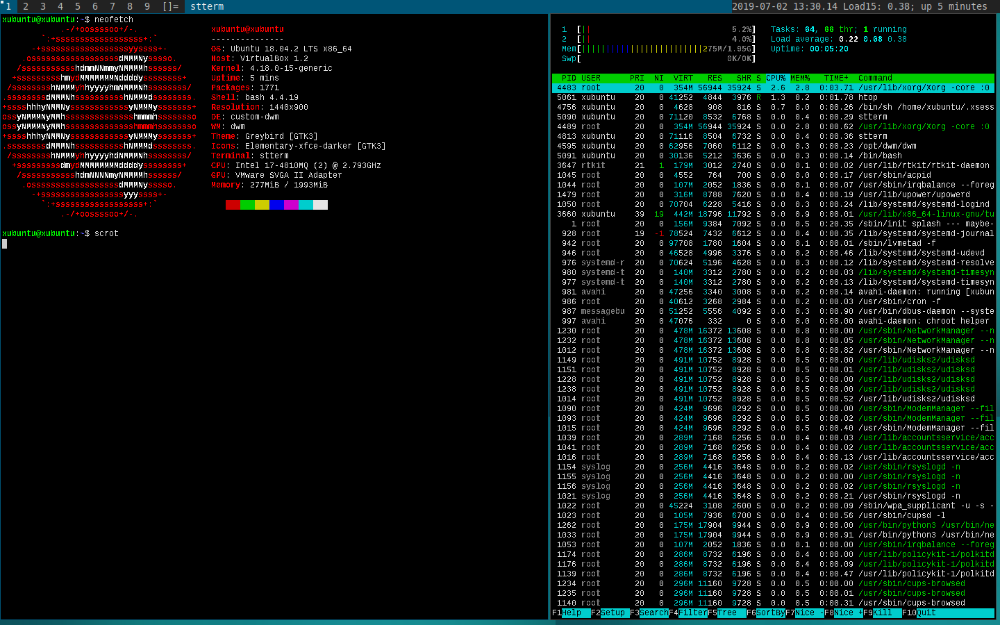

# my-buntu

Build scripts and customization files to build custom Ubuntu ISO image




## How to install and DWM at Ubuntu 

* Install packages 

```
sudo apt install neofetch htop dwm suckless-tools stterm dmenu curl mc vim git emacs 
sudo apt install nitrogen 
```

* Run `nitrogen` and configure , add background directories and select you favourite image as wallpaper. 
* Select st as your default terminal emulator

```
sudo update-alternatives --config x-terminal-emulator 
```

   
* Create `~/.xinitrc` file 

```

#~/.xinitrc

exec nitrogen --restore &
#exec compton -b &

while true ; do 

    load=$(cat /proc/loadavg |cut -d " " -f 3 )
    uptime=$(uptime -p)
    load_uptime="Load15: ${load}; ${uptime}"

    xsetroot -name "`date '+%Y-%m-%d %H:%M.%S' ` $load_uptime "; sleep 1; 
done &

exec dwm

```

* Make it executable and create a symbolic link .xsession

```
chmod 755 ~/.xinitrc
ln -s ~/.xinitrc ~/.xsession

```

* Create a file `/usr/share/xsessions/custom-dwm.desktop`

```
[Desktop Entry]
Name=Custom-DWM
Exec=/etc/X11/Xsession

```


* **Voila  - Now you can select stock DWM or your custom DWM session on loggin screen.**


### Different ways to build custom ISO I found in the Internet resources

1. https://sourceforge.net/projects/pinguy-os/files/ISO_Builder/

2. https://www.debuntu.org/how-to-customize-your-ubuntu-live-cd/
https://www.debuntu.org/how-to-customize-your-ubuntu-live-cd-page-2/

3. https://help.ubuntu.com/community/LiveCDCustomization
use genisoimage  
do not use mkisofs
https://nathanpfry.com/how-to-customize-an-ubuntu-installation-disc/

4. https://help.ubuntu.com/community/LiveCDCustomizationFromScratch

5. CUBIC
https://www.techrepublic.com/article/how-to-create-a-custom-ubuntu-iso-with-cubic/
https://www.linuxuprising.com/2018/07/how-to-customize-ubuntu-or-linux-mint.html

## LiveCDCustomization way 

* Based on https://nathanpfry.com/how-to-customize-an-ubuntu-installation-disc/

* run as root user:

```
apt -y install squashfs-tools genisoimage

cd ~/my-buntu

BUILD_TOOLS_ROOT=`pwd`
cd ~/

BASE_ISO_IMAGE_NAME="xubuntu-18.04.3-desktop-amd64.iso"
BASE_ISO_IMAGE_PATH=~/Downloads/${BASE_ISO_IMAGE_NAME}
if [ ! -e ${BASE_ISO_IMAGE_PATH} ]; then
	wget -O ${BASE_ISO_IMAGE_PATH} http://nl.archive.ubuntu.com/ubuntu-cdimage-xubuntu/releases/18.04/release/xubuntu-18.04.3-desktop-amd64.iso 
fi 
sleep 1 
sudo rm -rf ~/custom-img/  || true 


mkdir -p ~/custom-img/
echo "cp ${BASE_ISO_IMAGE_PATH} ~/custom-img/"
cp -v ${BASE_ISO_IMAGE_PATH} ~/custom-img/
cd ~/custom-img
ls -alh 

mkdir mnt
sudo mount -o loop ${BASE_ISO_IMAGE_NAME} mnt

mkdir iso_image_disk

rsync --exclude=/casper/filesystem.squashfs -a mnt/ iso_image_disk
ls -alh iso_image_disk/

sudo rm -rf squashfs-root || true 
sudo unsquashfs mnt/casper/filesystem.squashfs
mv squashfs-root new_chroot

#sudo cp -rv ${BUILD_TOOLS_ROOT}/includes.chroot/* new_chroot/

sudo bash customization-script.sh ${BUILD_TOOLS_ROOT}

sudo cp /etc/resolv.conf new_chroot/etc/

sudo mount --bind /dev/ new_chroot/dev
sudo chroot new_chroot

mount -t proc none /proc
mount -t sysfs none /sys
mount -t devpts none /dev/pts


export HOME=/root
export LC_ALL=C
dbus-uuidgen > /var/lib/dbus/machine-id
dpkg-divert --local --rename --add /sbin/initctl
ln -s /bin/true /sbin/initctl

apt-get update && apt-get -y upgrade
source functions.sh

install_custom_packages

apt-get autoremove && apt-get autoclean
rm -rf /tmp/* ~/.bash_history
rm /var/lib/dbus/machine-id
rm /sbin/initctl
dpkg-divert --rename --remove /sbin/initctl

#Unmount the directories from the beginning of this guide:

umount /proc || umount -lf /proc
umount /sys
umount /dev/pts
exit
sudo umount new_chroot/dev

#Generate a new file manifest:
sudo chmod +w iso_image_disk/casper/filesystem.manifest
sudo chroot new_chroot dpkg-query -W --showformat='${Package} ${Version}\n' | sudo tee iso_image_disk/casper/filesystem.manifest
sudo cp iso_image_disk/casper/filesystem.manifest iso_image_disk/casper/filesystem.manifest-desktop
sudo sed -i '/ubiquity/d' iso_image_disk/casper/filesystem.manifest-desktop
sudo sed -i '/casper/d' iso_image_disk/casper/filesystem.manifest-desktop

#Compress the filesystem:
sudo mksquashfs new_chroot iso_image_disk/casper/filesystem.squashfs -b 1048576

#Update filesystem size (needed by the installer):
printf $(sudo du -sx --block-size=1 new_chroot | cut -f1) | sudo tee iso_image_disk/casper/filesystem.size

#Delete the old md5sum:
cd iso_image_disk
sudo rm md5sum.txt

#…and generate a fresh one: (single command, copy and paste in one piece)

find -type f -print0 | sudo xargs -0 md5sum | grep -v isolinux/boot.cat | sudo tee md5sum.txt

#And finally, create the ISO. This is a single long command, be sure to copy and paste it in one piece and don’t forget the period at the end, it’s important:

DATE_TIME=`date '+%Y-%m-%d_%H%M'`
sudo genisoimage -D -r -V "$IMAGE_NAME" -cache-inodes -J -l -b isolinux/isolinux.bin -c isolinux/boot.cat -no-emul-boot -boot-load-size 4 -boot-info-table -o ../my-buntu-18.04.3-${DATE_TIME}.iso . 


cd ..
ls -alh `pwd`/my-buntu-18.04.3-${DATE_TIME}.iso

```


## DRAFT - testing Live build - not sure it that will work 

```
mkdir -p my-buntu/live-build-xubuntu-dwm
cd my-buntu/live-build-xubuntu-dwm

# when rebuilding and lots of stuff is messed run also clean , 
# sudo lb clean --purge

# be aware that the build.sh script in docker is running `lb clean` always

# build ISO
sudo docker run --privileged -i \
    -v /proc:/proc \
    -v ${PWD}/artifacts:/artifacts \
    -v ${PWD}:/working_dir \
    -w /working_dir \
    debian:latest \
    /bin/bash < build.sh

```


## LiveCDCustomization way for Kubuntu 18.04 LTS

* Based on https://nathanpfry.com/how-to-customize-an-ubuntu-installation-disc/

* run as root user:

```
apt -y install squashfs-tools genisoimage

cd ~/my-buntu

BUILD_TOOLS_ROOT=`pwd`
cd ~/

#http://cdimage.ubuntu.com/kubuntu/releases/18.04.3/release/kubuntu-18.04.3-desktop-amd64.iso
BASE_ISO_IMAGE_NAME="kubuntu-18.04.3-desktop-amd64.iso"
BASE_ISO_IMAGE_PATH=~/Downloads/${BASE_ISO_IMAGE_NAME}
if [ ! -e ${BASE_ISO_IMAGE_PATH} ]; then
	wget -O ${BASE_ISO_IMAGE_PATH} http://cdimage.ubuntu.com/kubuntu/releases/18.04.3/release/kubuntu-18.04.3-desktop-amd64.iso 
fi 
sleep 1 
sudo rm -rf ~/custom-img/  || true 


mkdir -p ~/custom-img/
echo "cp ${BASE_ISO_IMAGE_PATH} ~/custom-img/"
cp -v ${BASE_ISO_IMAGE_PATH} ~/custom-img/
cd ~/custom-img
ls -alh 

mkdir mnt
sudo mount -o loop ${BASE_ISO_IMAGE_NAME} mnt

mkdir iso_image_disk

rsync --exclude=/casper/filesystem.squashfs -a mnt/ iso_image_disk
ls -alh iso_image_disk/

sudo rm -rf squashfs-root || true 
sudo unsquashfs mnt/casper/filesystem.squashfs


sudo rm -rf new_chroot || true 
mv squashfs-root new_chroot

#sudo cp -rv ${BUILD_TOOLS_ROOT}/includes.chroot/* new_chroot/

sudo bash ${BUILD_TOOLS_ROOT}/kubuntu-customization-script.sh ${BUILD_TOOLS_ROOT}

sudo cp /etc/resolv.conf new_chroot/etc/

sudo mount --bind /dev/ new_chroot/dev/


sudo chroot new_chroot

mount -t proc none /proc
mount -t sysfs none /sys
mount -t devpts none /dev/pts


export HOME=/root
export LC_ALL=C
dbus-uuidgen > /var/lib/dbus/machine-id
dpkg-divert --local --rename --add /sbin/initctl
ln -s /bin/true /sbin/initctl


apt-get update && apt-get -y upgrade

## if needed, if upgrade fails with some configuration or dependency issue
#
# dpkg --configure -a 
# apt-get install -f 
# apt-get update && apt-get -y upgrade


source /functions.sh
install_custom_packages


apt-get autoremove && apt-get autoclean
rm -rf /tmp/* ~/.bash_history
rm /var/lib/dbus/machine-id
rm /sbin/initctl
dpkg-divert --rename --remove /sbin/initctl

#Unmount the directories from the beginning of this guide:

umount /proc || umount -lf /proc
umount /sys
umount /dev/pts
exit
sudo umount new_chroot/dev

#Generate a new file manifest:
sudo chmod +w iso_image_disk/casper/filesystem.manifest
sudo chroot new_chroot dpkg-query -W --showformat='${Package} ${Version}\n' | sudo tee iso_image_disk/casper/filesystem.manifest
sudo cp -v iso_image_disk/casper/filesystem.manifest iso_image_disk/casper/filesystem.manifest-desktop
sudo sed -i '/ubiquity/d' iso_image_disk/casper/filesystem.manifest-desktop
sudo sed -i '/casper/d' iso_image_disk/casper/filesystem.manifest-desktop

#Compress the filesystem:
sudo mksquashfs new_chroot iso_image_disk/casper/filesystem.squashfs -b 1048576

#Update filesystem size (needed by the installer):
printf $(sudo du -sx --block-size=1 new_chroot | cut -f1) | sudo tee iso_image_disk/casper/filesystem.size

#Delete the old md5sum:
cd iso_image_disk
sudo rm md5sum.txt

#…and generate a fresh one: (single command, copy and paste in one piece)

find -type f -print0 | sudo xargs -0 md5sum | grep -v isolinux/boot.cat | sudo tee md5sum.txt

#And finally, create the ISO. This is a single long command, be sure to copy and paste it in one piece and don’t forget the period at the end, it’s important:

DATE_TIME=`date '+%Y-%m-%d_%H%M'`
NEW_ISO_NAME="kubuntu-18.04.3-desktop-custom-${DATE_TIME}-amd64.iso"
sudo genisoimage -D -r -V "$IMAGE_NAME" -cache-inodes -J -l -b isolinux/isolinux.bin -c isolinux/boot.cat -no-emul-boot -boot-load-size 4 -boot-info-table -o ../${NEW_ISO_NAME} . 


cd ..
ls -alh `pwd`/${NEW_ISO_NAME}

```


## Upload to sourceforge 

MATE_RELEASE_NAME="ubuntu-mate-20.04.0-2020.06.10-desktop-amd64"
rsync --progress -e ssh  ${MATE_RELEASE_NAME}.* jacekkowalczyk8@frs.sourceforge.net:/home/frs/project/my-buntu/my-buntu/

