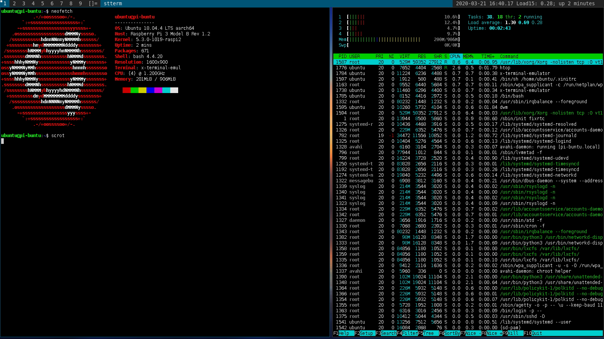

# How to install Ubuntu Server plus DWM (suckless.org) on Raspberry Pi3 Model B v1.2 

* Prepare SD  card 
* Use Raspberry Pi [imager application](https://downloads.raspberrypi.org/imager/imager.exe) to install Ubuntu Server to SD card. 
* Connect mouse, keyboard and monitor  to PI. 
* Connect power to boot it. 
* Default user name is ubuntu and password aslos ubuntu. the system will request you to chnage the password just after the first login. 
* Connect to WiFi following this [instructions](https://raspberrypi.stackexchange.com/questions/98598/how-to-setup-the-raspberry-pi-3-onboard-wifi-for-ubuntu-server-18-04-with-netpla)

```
sudo /etc/netplan/50-cloud-init.yaml 
# and add there entries like at the backup file: [50-cloud-init.yaml](configs/etc/netplan/50-cloud-init.yaml)

sudo netplan --debug try
sudo netplan --debug generate
sudo netplan --debug apply

sudo reboot
```

* After rebooting you can now use your wifi connection to update system and install apps:

```
sudo apt update 
sudo apt full-upgrade
sudo apt install htop vim mc tmux zip unzip curl nano git 

# sudo apt install make 
# sudo apt install gcc 
#   30  sudo apt install build-essential 
#   35  sudo apt install --reinstall linux-headers-generic

sudo apt install avahi-daemon
sudo apt install xorg dwm suckless-tools stterm i3lock 
sudo apt install feh 
sudo apt install scrot neofetch 
sudo apt install android-tools-adb 
sudo apt install android-tools-fastboot 

```

* Configure `/etc/udev/rules.d/` to be able to connect to Android devices. 

```
sudo apt install usb-modeswitch
# You will need to add rules files dedicated to your hardware to directory: /etc/udev/rules.d/
```

* Copy some backgrounds to /opt/backgrounds/
* Create ~/xinitrc file: 

```
exec feh --bg-scale /opt/backgrounds/pexels.com/dawn-desktop-backgrounds-dusk-2816056.jpg &

while true ; do 
    load=$(cat /proc/loadavg |cut -d " " -f 3 )
    uptime=$(uptime -p)
    load_uptime="Load15: ${load}; ${uptime}"
    xsetroot -name "`date '+%Y-%m-%d %H:%M.%S' ` $load_uptime "; sleep 1; 
done &

exec dwm

```

* Create link .xsession 

```
cd ~/
ln -s .xinitrc .xsession 

```

* Reboot pi and login back 
* Start DWM by `startx` command. 




